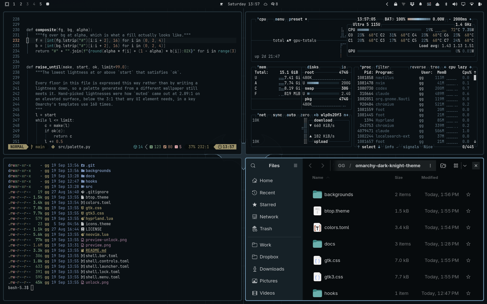

# Dark Knight

An [Omarchy](https://omarchy.org) theme. Gold and steel on ink, ported from the
design system behind [itsgg.com](https://itsgg.com).



## Install

```sh
omarchy theme install https://github.com/itsgg/omarchy-dark-knight-theme.git
```

Omarchy takes the theme name from the repo name, so this lands as `dark-knight`
and applies itself. To switch back to it later:

```sh
omarchy theme set "Dark Knight"
```

### What Omarchy drops when installing from a repo

A theme cloned from a git repo is not allowed to contribute files that run
code, so `neovim.lua` and `vscode.json` are dropped on install and Omarchy says
so on stderr. Neovim and VS Code still get themed — Omarchy regenerates both
from `colors.toml` through its own templates. The only thing lost is this
theme's preference for the Kanagawa colorscheme in each; see
[Neovim and VS Code](#neovim-and-vs-code) below if you want that too.

Both files are kept in the repo because they are correct for anyone who copies
the theme into `~/.config/omarchy/themes/` by hand, where no such restriction
applies.

## About the emblem

The bat is drawn from scratch in `src/bat.py` — it is a fan rendition, not a
copy of any official artwork. Batman and the bat emblem are trademarks of DC
Comics. This is an unofficial, non-commercial fan theme with no affiliation
with or endorsement by DC. See [NOTICE](NOTICE).

## Token mapping

The site's primitives map onto Omarchy's keys one for one, so a colour changed
in `_tokens.scss` has exactly one counterpart here.

| Site primitive | Hex       | Omarchy key                          |
|----------------|-----------|--------------------------------------|
| `--ink-900`    | `#0e0f12` | `background`                         |
| `--ink-700`    | `#1e2127` | `lighter_background`                 |
| `--line-600`   | `#2a2e35` | `hyprland_inactive_border`           |
| `--paper-100`  | `#d2d6dc` | `foreground`                         |
| `--slate-400`  | `#9ba3b0` | `light_foreground`                   |
| `--slate-500`  | `#7e8694` | `dark_foreground`                    |
| `--gold-500`   | `#c9a227` | `accent`, active border stop 1        |
| `--gold-400`   | `#e0bc46` | `yellow`, active border stop 2        |
| `--steel-500`  | `#5b8db8` | `blue`                               |
| `--steel-300`  | `#84b0d8` | `bright_blue`                        |
| `--success`    | `#3fb950` | `green`                              |
| `--error`      | `#f85149` | `red`                                |

Two keys are derived rather than copied:

- `selection` (`#423818`) is `--selection-bg` — gold at 28% over `--ink-900` —
  flattened, because Omarchy wants an opaque colour where CSS took an alpha.
- `muted` (`#545a64`) is the midpoint of `--line-600` and `--slate-500`. The
  design system has no token at that level, and Omarchy needs one for the
  structural slot -- ANSI `color8`, borders, indent guides, dividers. It is
  deliberately dim: at 2.76:1 on the ground it sits above the median of the
  stock dark themes (2.26:1; matte-black runs 1.48:1). Do not "fix" it up to
  a text-contrast ratio -- that is `dark_foreground`'s job, and it already
  carries `--slate-500` at 5.22:1.

`orange`, `cyan`, `magenta` and `brown` have no counterpart in the design
system at all. They are derived in-family — warm hues bent toward the brass,
cool toward the steel — rather than borrowed from an unrelated palette, so a
full 16-colour ANSI app still looks like it belongs here.

`foreground`/`background` contrast is 13.13:1, matching the ratio
`_tokens.scss` documents for the same pair.

## Backgrounds

Three, all generated — no stock photography, no raster source at all.

An earlier set went the other way: rendered cloud, layered skylines, volumetric
beams. It was rejected as "too blurry, too blocky, too much", and that was the
right call. These are flat. No blur filters anywhere, no blocks; every edge is a
real vector edge and the only soft thing in a frame is the vignette.

| File             | What it is                                                     |
|------------------|----------------------------------------------------------------|
| `1-grid.jpg`     | Steel hairline grid, gold axes on thirds, emblem at the origin. |
| `2-emblem.jpg`   | The emblem as outline, off-centre, on bare ink.                 |
| `3-rings.jpg`    | Concentric hairlines off a centre near the right edge, one measured gold ring. |

The emblem appears in all three at a different scale each time — the subject in
one, a mark at a grid origin in another, the source of the sweep in the third.
That is what makes them a set rather than three unrelated images.

`src/bat.py` holds the emblem, authored as cubic beziers. An earlier version
built it from straight line segments and it read as a sawblade — the classic
emblem's trailing edge is a run of smooth scallops between sharp downward
spikes, and polylines cannot make that. Two constraints the shape depends on
are noted in that file: the wing's top edge must never dip below the shoulder
(when it sags, the head reads as a crown perched on a separate boomerang), and
the notch between the ears stays narrow and shallow.

`src/flat.py` composes the three wallpapers, `src/render.sh` renders everything.

### The noise pass is load-bearing

These are near-black grounds with a wide vignette. At 8 bits per channel that
gradient bands into visible concentric rings without a dither, so `render.sh`
adds Gaussian noise after rasterising. Do not move it into the SVG as an
`feTurbulence` overlay — librsvg flattens that into a uniform +3-level wash,
which pushes the ground off `--ink-900`.

## Neovim and VS Code

Neither has a Dark Knight port. Both point at Kanagawa, the closest match in
each ecosystem: warm gold on near-black, the same relationship as
`--gold-500` on `--ink-900`.
