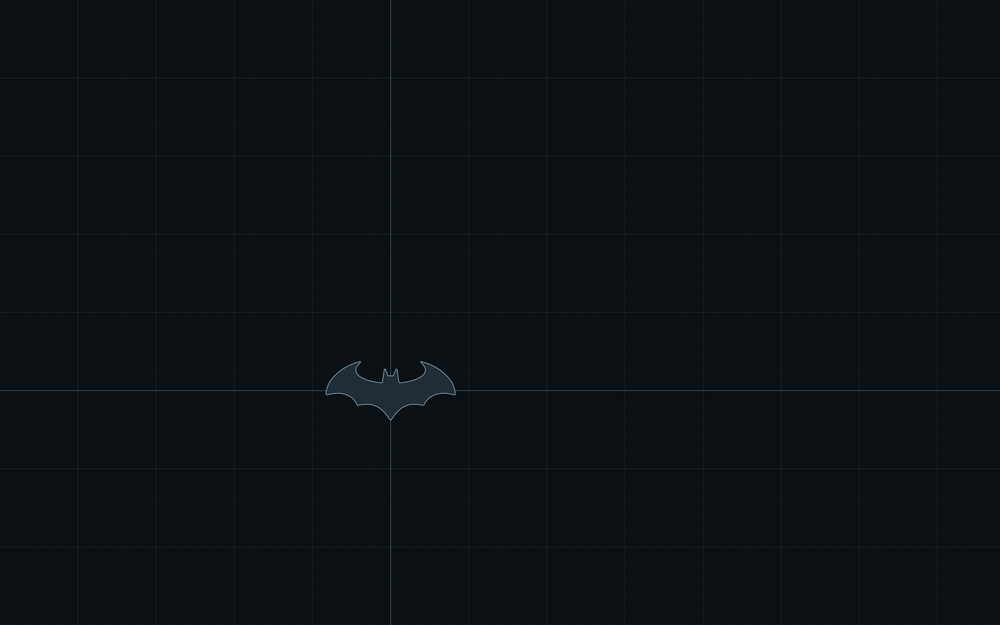
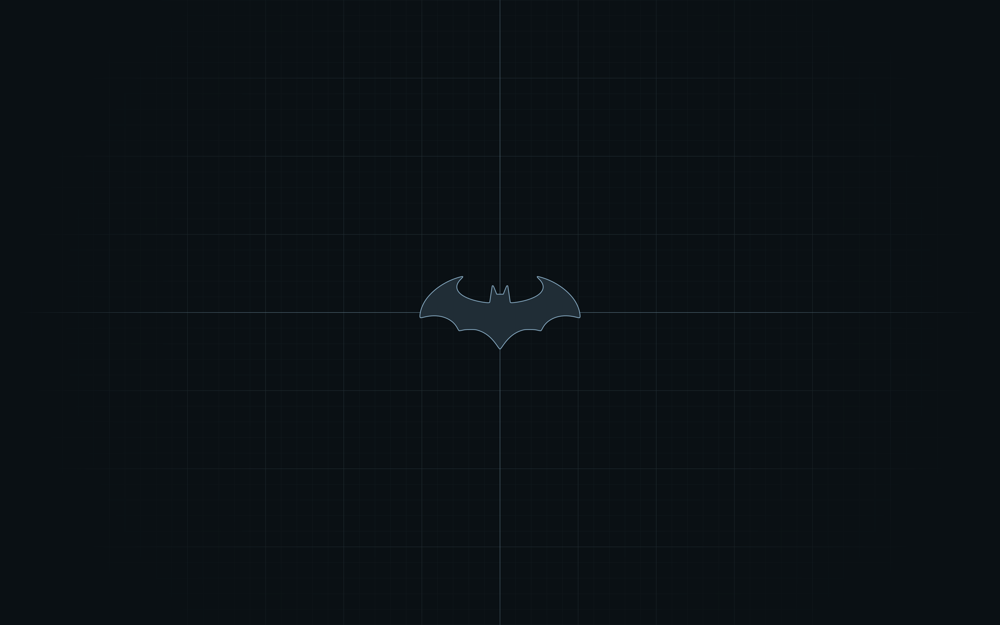
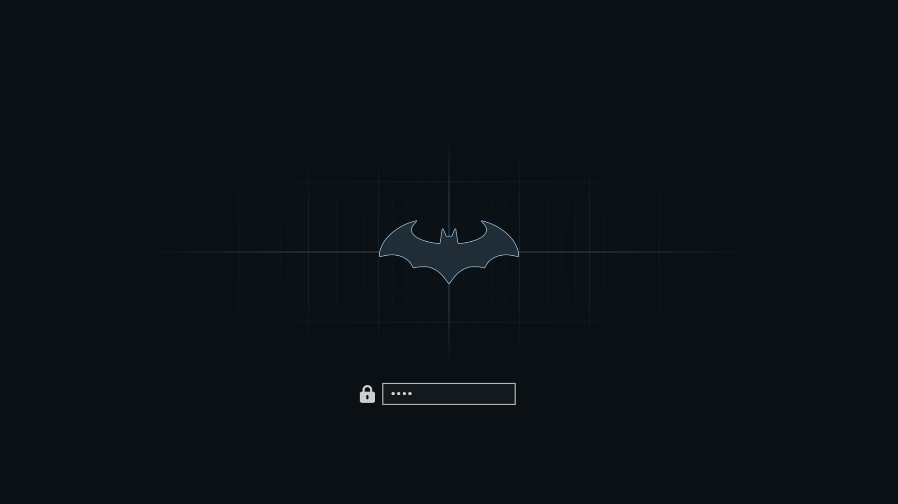

# Dark Knight

A dark, flat, single-hue theme for [Omarchy](https://omarchy.org).


One steel-blue hue, with hierarchy carried by lightness. The palette is
generated by a script and checked against WCAG contrast floors. Every fill
is flat, and the theme adds no glow or blur.

## Previews

| Grid | Origin |
|---|---|
|  |  |

The boot and disk-unlock screen uses the same picture as the Origin wallpaper:



## Install

```sh
omarchy theme install https://github.com/itsgg/omarchy-dark-knight-theme.git
```

Switch back to it later with `omarchy theme set "Dark Knight"`.

Optional:

```sh
# GTK apps and the file chooser follow the theme
omarchy hook install theme-set ~/.config/omarchy/themes/dark-knight/hooks/gtk-follow-theme

# Boot and disk-unlock screen (asks for your password, rebuilds the initramfs)
omarchy plymouth set by theme dark-knight
```

Updating, and the working-copy install that also gets the Neovim syntax
overrides, are in [docs/INSTALL.md](docs/INSTALL.md).

## Palette

| Key | Hex | Use |
|---|---|---|
| `background` | `#0A1014` | ground |
| `lighter_background` | `#162128` | raised surfaces |
| `line` | `#283943` | rules, guides, inactive border |
| `muted` | `#687F8D` | comments, line numbers |
| `foreground` | `#CCCFD1` | text |
| `accent` | `#99C1DC` | focus, selection, links |
| `active_border` | `#739BB5` | focused window |
| `red` | `#BF878C` | |
| `orange` | `#B88D75` | |
| `yellow` | `#A1966D` | |
| `green` | `#7B9F7E` | |
| `cyan` | `#5BA1A3` | |
| `blue` | `#7F97BE` | |
| `magenta` | `#B389A7` | |

## What is included

Everything Omarchy generates from `colors.toml` (terminals, Hyprland, the
shell, Chromium, VS Code, Obsidian), plus:

| File | |
|---|---|
| `backgrounds/` | two flat vector wallpapers |
| `shell.*.toml` | bar, launcher, menu, lock card, control states |
| `neovim.lua` | quiet indent guides, syntax colour kept for data |
| `gtk.css`, `gtk3.css` | libadwaita and the GTK3 file chooser |
| `btop.theme` | monochrome meters |
| `unlock.png` | Plymouth boot screen, matching the wallpaper |

## Development

```sh
python3 src/palette.py > colors.toml   # fails if a contrast floor is missed
src/render.sh                          # regenerates everything from colors.toml
src/preview.sh                         # retakes preview.png
```

Design notes: [docs/DESIGN.md](docs/DESIGN.md).

## License

MIT. See [LICENSE](LICENSE).
